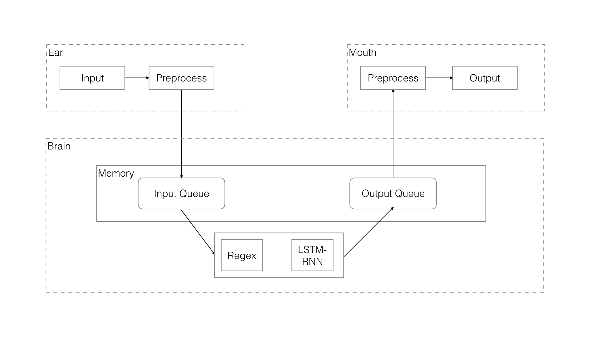

# Gakki

Gakki is a mixed architecture chat bot. It was designed to simulate conducting dialogues with humans. 

An example of typical input would be some thing like this:

> **user:** Hello  
> **Gakki:** Hi there!  
> **user:** Good morning! How are you doing?  
> **Gakki:** I am working on the HCI homework, thank you for asking.  
> **user:** How is your candidacy exam?  
> **Gakki:** I failed it!  

## Goal
I have designed and implemented the Gakki, a chat bot to conducts a conversation via text.
Gakki shares many of the same goal as previous chat bot. However, its design has been driven
some limitations of existing chat bots like ELIZA, ALICE, XiaoIce. I have reflected traditional
choices and explored radically different points in the design space.
### Personification
Current chat bots are either Rule-based or Corpus-based. For both of them, they are just some
mixed regular expressions, parsers or complicated machine learning algorithms. Inspired
by cognitive science, I was wondering if I could imitate how human minds work. I try to
name part the corresponding name in human body, which increases code's readability and abstraction
level.
### Simple
I don't have time to write a complicated chat bot. Also, I don't expect the chat bot to 
speak many languages or serve various goals and purposes. Apart from designs, its implementation
also should be as simple. For example, I don't need to re-implement some deep learning 
library.
### Mixed Model
Existing chat bots are either rules-based or corpus-based. Rule-based models are good at handling
situations which were defined before. But every rules need to be pre-defined before. Corpus-based
model typically use deep learning to predict the next sentence. However, it need to be trained 
before. For some sentence like "What is the time", the accuracy won't increase even prolong
the training time.

## Design Overview
This part will introduce three main components of Gakki.

### Architecture
#### Mouth and Ear
Mouth is the first component of the chat bot. It basic function is to get input from terminal,
After that, it will preprocess the input and store it in the Memory.
##### 1. CLean whitespace and Convert to ASCII
The first step is to any consecutive whitespace characters from the text and Converts unicode characters to 
ASCII character equivalents.
##### 2. Remove Noise
Any text that is independent of the data context and the final output can be sentenced to noise.
The general practice of removing noise is to prepare a dictionary of noise entities, one by one on the text object (or 
word by word) iteration, to eliminate the noise dictionary appears in the label.

Here is the python code:
~~~~
def __remove_noise(text):
    """    
    :param text: 
    :return: noise_free_text
    """
    # may update in the future
    noise_list = ["is", "a", "this", "..."]
    words = text.split()
    noise_free_words = [word for word in words if word not in noise_list]
    text = " ".join(noise_free_words)
    return text
~~~~
#### 3. Standard text
Text data often contains words or phrases that do not appear in any standard dictionary. Both search engines and models
can not recognize these.

For example, acronyms, vocabulary labels and popular slang. This type of noise can be repaired by regular expressions 
and manually prepared data dictionaries. The following code uses the dictionary lookup method to replace the social 
slang in the text.

Here is the python code:
~~~~
def __lookup_words(text):
    words = text.split() 
    new_words = [] 
    for word in words:
        if word.lower() in lookup_dict:
            word = lookup_dict[word.lower()]
        new_words.append(word) new_text = " ".join(new_words) 
        return new_text
~~~~
Currently, the lookup_dict is from NLTK, a suite of libraries and programs for symbolic and statistical natural language
processing (NLP).
#### Brain
Brain component has two parts, the first part is going to use regular expression to match the input sentences that are 
stored in the queue. If it matches, then the regular expression  part will export the sentence to the ouput queue that
are in the Memory. If not, the LSTM-RNN part will process the statement.
##### Regular Expression
Regular Expression was designed to respond some fixed structure sentence like "What is the time?", "100-93=?". LSTM-RNN
models aren't good at handling these kinds of questions.

Some codes of the part from the existing projects on the GitHub.
##### LSTM-RNN
LSTM (Long Short Tem Memory) is a special recurrent neural network, its particularity is that its neuron design can save 
the historical memory, which can solve the natural language processing of statistical methods can only consider the 
recent n words and ignore The question of the words before the longer.

I referred to the code from (https://iamtrask.github.io/2015/11/15/anyone-can-code-lstm/ "LSTM").
In order to be able to apply word vectors, we use word2vec to generate word vectors.
~~~
def __predict_nextword():
    init_seq()
    xlist = []
    ylist = []
    test_X = None
    #for i in range(len(seq)-100):
    for i in range(10):
        sequence = seq[i:i+20]
        xlist.append(sequence)
        ylist.append(seq[i+20])
        if test_X is None:
            test_X = np.array(sequence)
            (match_word, max_cos) = vector2word(seq[i+20])
            print "right answer=", match_word, max_cos

    X = np.array(xlist)
    Y = np.array(ylist)
    net = tflearn.input_data([None, 20, 200])
    net = tflearn.lstm(net, 200)
    net = tflearn.fully_connected(net, 200, activation='linear')
    net = tflearn.regression(net, optimizer='sgd', learning_rate=0.1,
                                     loss='mean_square')
    model = tflearn.DNN(net)
    model.fit(X, Y, n_epoch=500, batch_size=10,snapshot_epoch=False,show_metric=True)
    model.save("model")
    predict = model.predict([test_X])
    return predict
~~~
### Problem
Currently the main problem for the project is to find enough dataset to train the models. Initially, I thought NLTK
may provide enough corpus. However, few of them are conversations. Recently, I realized I could use movie subtitle.
Maybe I will do it in the future.

## Related Work
### ChatterBot
ChatterBot is a machine-learning based conversational dialog engine build in Python which makes it possible to generate 
responses based on collections of known conversations. Due to its design, it to be trained to speak any language.

The main limitations of the ChatterBot is that it can only speak the sentence that was used to it before. In other
words, it can't produce any new sentence.
### NLTK
Natural Language Processing Toolkit is the most commonly used Python library in the NLP field. NLTK has a chat package.
With the help of the package, people can build a rules-based chat bot in a some simple efforts.
# Future Work
- Finish the train part
- Integrate with Django and put a small demo on the AWS
# License
ChatterBot is licensed under the [BSD 3-clause license](https://opensource.org/licenses/BSD-3-Clause).
# Reference
